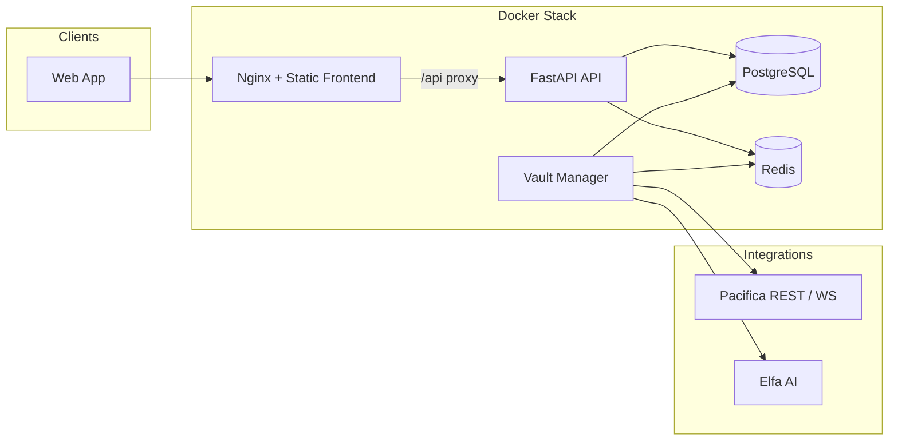

# Zerova Protocol

**Delta-neutral yield on Pacifica perpetuals.** Zerova is a non-custodial vault design that issues `zvUSDC` shares, allocates capital across spot-style collateral and hedged short perpetual exposure, and automates monitoring, NAV snapshots, and operational health checks.

---

## Demo

**Watch the full walkthrough:** [Zerova Protocol — Demo Video](https://youtu.be/yfYnknYCFBA)

Direct link: `https://youtu.be/yfYnknYCFBA`

---

## What Zerova Does

- **Vault shares (`zvUSDC`)** — Deposit USDC (conceptually routed via integrations such as Rhinofi); accounting and NAV logic run in the backend.
- **Hedged perp leg** — Short perpetual exposure on **Pacifica** to target a delta-neutral profile while capturing funding dynamics (subject to market conditions and risk controls).
- **Automation** — `vault_manager` service: position sync from Pacifica, scheduled NAV, rebalancing hooks, signal refresh (Elfa), and WebSocket monitoring when a signing key is configured.
- **Web app** — React + Vite dashboard: vault stats, charts, deposit/withdraw flows, builder approval helpers, referrals (Fuul), and Privy-ready wallet auth.

---

## Architecture (High Level)



| Service | Role |
|--------|------|
| **frontend** | Production build served by Nginx; proxies `/api` to the API container. |
| **api** | REST API (`/api/v1/...`), OpenAPI at `/docs`, health at `/health`. |
| **vault_manager** | Background jobs: NAV, position sync, rebalancer, signals, health checks, Pacifica WebSocket (when configured). |
| **postgres** | Vault state, users, events, NAV history. |
| **redis** | Signal caching and rate limiting support. |

---

## Tech Stack

| Layer | Choices |
|--------|---------|
| **Frontend** | React 18, TypeScript, Vite, Tailwind CSS, TanStack Query, Zustand, Framer Motion, Recharts, Privy |
| **Backend** | Python 3.11, FastAPI, APScheduler, asyncpg, httpx, Redis |
| **Exchange** | Pacifica (Solana) — REST signing + WebSocket monitor |
| **Ops** | Docker Compose |

---

## Prerequisites

- [Docker](https://docs.docker.com/get-docker/) and [Docker Compose](https://docs.docker.com/compose/) v2+
- A copy of environment variables (see below). **Never commit real secrets.**

---

## Quick Start

1. **Clone the repository**

   ```bash
   git clone <your-repo-url> zerova
   cd zerova
   ```

2. **Configure environment**

   ```bash
   cp .env.example .env
   ```

   Edit `.env` and set at least:

   - `PACIFICA_PRIVATE_KEY` — Base58-encoded Solana private key for the vault operator account on Pacifica (leave empty only for local **dev-mode** stubs in the executor/monitor).
   - `VITE_PRIVY_APP_ID` — For embedded wallets in the UI (Compose passes a build arg; use a real app ID for production builds).
   - Optional: `ELFA_API_KEY`, `RHINOFI_API_KEY`, Fuul keys — enable respective integrations.

   For **Pacifica testnet**, point `PACIFICA_API_URL` / `PACIFICA_WS_URL` at the official test endpoints (see [Pacifica test app](https://test-app.pacifica.fi/)).

3. **Build and run**

   ```bash
   docker compose up -d --build
   ```

4. **Open the app**

   | URL | Description |
   |-----|-------------|
   | [http://localhost:3000](http://localhost:3000) | Zerova web UI (Nginx → static assets; `/api` proxied to API) |
   | [http://localhost:8000/docs](http://localhost:8000/docs) | OpenAPI (Swagger) for the FastAPI service |
   | [http://localhost:8000/health](http://localhost:8000/health) | Liveness probe |

---

## Repository Layout

```text
backend/           # FastAPI app, vault manager, Pacifica client, DB layer
frontend/        # Vite + React SPA, Nginx config for production image
docker-compose.yml
.env.example       # Template only — copy to .env (gitignored)
```

---

## API Overview

Base path: `/api/v1`

| Area | Example |
|------|---------|
| Vault | `GET /vault/stats`, `GET /vault/nav/history`, `GET /vault/positions`, `POST /vault/deposit`, `POST /vault/withdraw` |
| User | `GET /user/{wallet}/position`, `GET /user/{wallet}/history`, `GET /user/{wallet}/referral` |
| Signals | `GET /signal/{asset}` |

Interactive documentation: [http://localhost:8000/docs](http://localhost:8000/docs)

---

## Security & Compliance

- **Do not commit** `.env`, private keys, or API keys. `.env` is listed in `.gitignore`.
- Use testnet keys and small notional sizes when experimenting.
- Review Pacifica’s own terms, builder program rules, and jurisdictional restrictions before mainnet use.

---

## Useful Links

| Resource | URL |
|----------|-----|
| **Demo video** | [https://youtu.be/yfYnknYCFBA](https://youtu.be/yfYnknYCFBA) |
| Pacifica (testnet app) | [https://test-app.pacifica.fi/](https://test-app.pacifica.fi/) |

---

## Contributing

Issues and pull requests are welcome. Please keep changes focused, avoid committing secrets, and match existing code style.

---

## Disclaimer

This software is provided for **educational and demonstration purposes**. It is not financial, legal, or investment advice. DeFi and perpetual futures involve substantial risk of loss. Use at your own risk.
